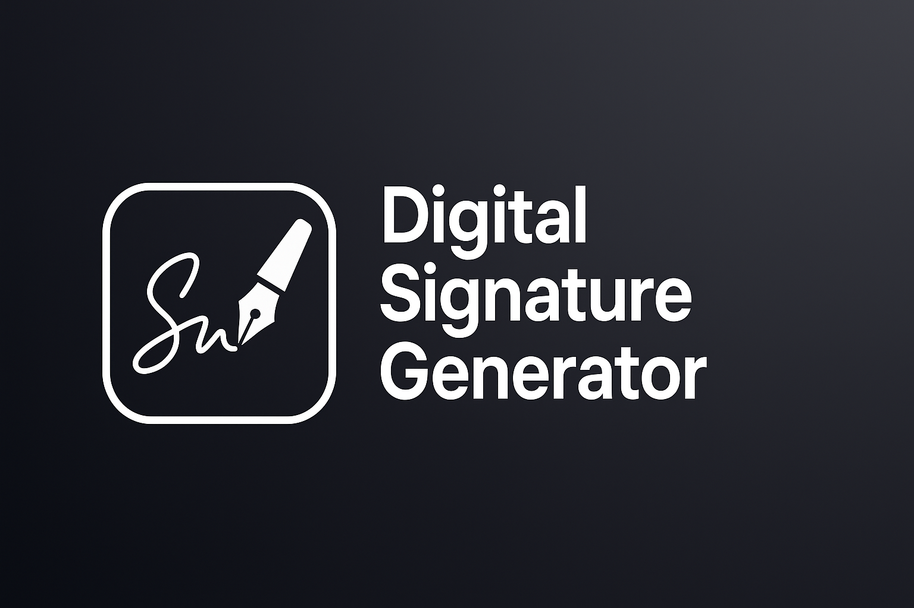

<h1 align="center">Digital Signature Generator</h1>

<p align="center"><strong>Create clean, realistic digital signatures and export them as transparent PNGs.<strong></p>

A modern, production-ready React + TypeScript application for creating beautiful digital signatures with full customization options. Perfect for personalizing documents, emails, and digital artwork.


## What it does

- Type or draw your signature
- Tweak basic styling (font, size, color)
- Export as transparent image for documents and emails

## Features

Supports Dual Signature Modes:
- **Typed Signatures**: Type your name and customize with 20+ handwriting fonts
- **Freehand Drawing**: Draw signatures naturally with pressure-sensitive pen simulation

## 🚀 Getting Started

### Prerequisites

Node.js 18+ and npm/yarn/pnpm

### Installation

```bash
# Clone the repository
git clone https://github.com/vinitshahdeo/digital-signature-generator.git
cd digital-signature-generator

# Install dependencies
npm install

# Start development server
npm run dev

# Open http://localhost:5173 in your browser
# That’s it — keep it simple, sign, tweak, export. ✍️
```

### Build for Production

```bash
# Create optimized production build
npm run build

# Preview production build locally
npm run preview
```


## 🎨 Included Fonts

The app includes 20 beautiful handwriting fonts:

1. **Sacramento** - Elegant cursive
2. **Great Vibes** - Sophisticated script
3. **Dancing Script** - Lively and friendly
4. **Caveat** - Handwritten casual
5. **Allura** - Romantic calligraphy
6. **Satisfy** - Brushed script
7. **Pacifico** - Surf-inspired bold
8. **Homemade Apple** - Authentic handwriting
9. **Shadows Into Light** - Playful marker style
10. **Cookie** - Sweet cursive
11. **Alex Brush** - Classic brush script
12. **Amatic SC** - Hand-drawn bold
13. **Indie Flower** - Quirky handwriting
14. **Kaushan Script** - Energetic brush
15. **La Belle Aurore** - Vintage handwriting
16. **Marck Script** - Formal calligraphy
17. **Mrs Saint Delafield** - Copperplate script
18. **Pinyon Script** - Delicate flourishes
19. **Tangerine** - Feminine cursive
20. **Yellowtail** - Smooth brush script


## ⚖️ Legal Notice

**Important**: Signatures created with this tool are for **personalization and creative purposes only**. They are **NOT legally binding** and should not be used as a substitute for handwritten signatures on legal documents, contracts, or official forms.

For legally binding electronic signatures, use certified e-signature services that comply with regulations like eIDAS, ESIGN, or UETA.

## 🤝 Contributing

Contributions are welcome! Please feel free to submit a Pull Request.

1. Fork the repository
2. Create your feature branch (`git checkout -b feature/AmazingFeature`)
3. Commit your changes (`git commit -m 'Add some AmazingFeature'`)
4. Push to the branch (`git push origin feature/AmazingFeature`)
5. Open a Pull Request

## 📄 License

This project is licensed under the **MIT License** - see the [LICENSE](LICENSE) file for details.

## 🙏 Acknowledgments

- Font families from [Google Fonts](https://fonts.google.com/)
- UI components from [shadcn/ui](https://ui.shadcn.com/)
- Icons from [Lucide](https://lucide.dev/)
- Canvas rendering powered by [Konva](https://konvajs.org/)

## 📧 Contact

**Vinit Shahdeo**
- GitHub: [@vinitshahdeo](https://github.com/vinitshahdeo)
- Twitter: [@vinitshahdeo](https://twitter.com/vinit_shahdeo)

---

<p align="center">Made with ❤️ by <a href="https://github.com/vinitshahdeo">Vinit Shahdeo</a></p>
<p align="center">
  <a href="https://github.com/vinitshahdeo/digital-signature-generator/stargazers">⭐ Star this repo</a> if you find it useful!
</p>
